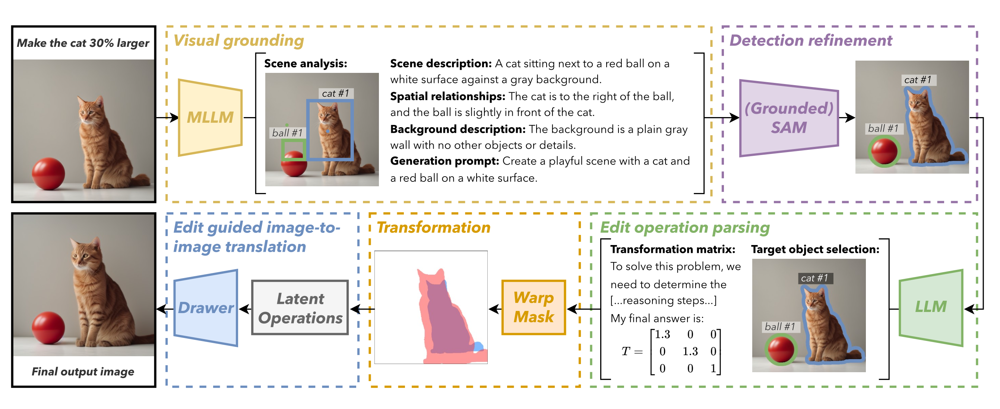

# 📜 POEM: Precise Object-level Editing via MLLM control

This project aims to allow image editing via precise instructions (e.g. move cat to the left by 12.5 px). Our method synthesizes a new image according to the editing instruction. We do this using off-the-shelf diffusion models and MLLMs with no training or fine-tuning.

<p>
  
</p>
<p><i><b>Pipeline Description:</b> Given an image and an edit prompt, we first
use an MLLM to analyze the scene and identify objects. Then, we refine the detections
and enhance object masks using Grounded SAM. Next, we use a text-based LLM
to predict the transformation matrix of the initial segmentation mask. Finally, we
perform an image-to-image translation guided by the previous steps to generate the
edited image. This structured pipeline enables precise object-level editing with high
visual fidelity while preserving spatial and visual coherence.</i></p>


## 📦 Installation
### Virtual Environment Setup
Follow these steps to set up the environment:
```bash
module load python3/3.10.12
module load cuda
python3 -m venv ./.venv/
source ./.venv/bin/activate
./scripts/install_packages.sh
```
Note that the LLM **eepseekR1-32GB** requires ~74GB VRAM.
- **SAM2**: Requires `python>=3.10`, `torch>=2.5.1`, and `torchvision>=0.20.1`
- **QWEN-Math**: Requires `transformers>=4.37.0`


## ⚙️ Usage
-  run notebook
```python
python -m notebook --ip 0.0.0.0 --no-browser --port=8080 --allow-root
```
- run pipeline
```python
module load python3/3.10.12
module load cuda
source ./.venv2/bin/activate
python src/main.py --in_dir input_debug --out_dir output_debug --edit "grayscale"
```


## 📐 Notation
- Image Coordinates: Square images are defined with the top-left at [0, 0] and the bottom-right at [1, 1].
- Box Format: [Top-left x, Top-left y, Width, Height]
- Operations: Includes addition, deletion, and repositioning.
- images are 512x512 squaredl; to keep aspect ratio we put black boxes. NOTE: that instead of black pixles, we use "gray" pixels that is the mean value of the standard imagenet images.


We compare POEM to state-of-the-art image editing
models. We test our edit instructions using translation, scaling, appearance changing,
and a combination of them to showcase the precision of our pipeline.


## 📚 References

[1] Epstein, Dave, et al. "Diffusion self-guidance for controllable image generation." Advances in Neural Information Processing Systems 36 (2023): 16222-16239.

[2] Wu, Tsung-Han, et al. "Self-correcting llm-controlled diffusion models." Proceedings of the IEEE/CVF Conference on Computer Vision and Pattern Recognition. 2024.


<!--
```
 messages = [
        {"role": "system", "content": ". Given scene content and user edit request, determine the appropriate transformation matrix.\n\n"
                                    "Scene content: " + scene_context + "\n\n"
                                    "Available transformations:\n"
                                    "1. Translation [[1 0 tx][0 1 ty][0 0 1]]\n"
                                    "2. Rotation [[cos(θ) -sin(θ) 0][sin(θ) cos(θ) 0][0 0 1]]\n"
                                    "3. Scale [[sx 0 0][0 sy 0][0 0 1]]\n"
                                    "4. Shear [[1 shx 0][shy 1 0][0 0 1]]\n\n"
                                    "Combined transformations are allowed by matrix multiplication.\n\n"
                                    "IMPORTANT: Your response MUST include the final transformation matrix after the token '$answer$' in this exact format:\n"
                                    "$answer$\n"
                                    "[[0.88 0.  0. ]\n"
                                    " [0.  0.88 0. ]\n"
                                    " [0.  0.  1. ]]"},
        {"role": "user", "content": user_edit}
    ]
```

```
messages = [
        {"role": "system", "content": "Integrate natural language reasoning with programs to solve user query. Given the scene content and the user edit, determine the appropriate transformation matrix for the requested edit.\n\n"
                                    "Scene content: " + scene_context + "\n\n"
                                    "List of possible operations:\n"
                                    "1. Translation: Moving objects in x,y directions\n"
                                    "   Example: [[1 0 tx][0 1 ty][0 0 1]]\n\n"
                                    "2. Rotation: Rotating objects by angle θ\n"
                                    "   Example: [[cos(θ) -sin(θ) 0][sin(θ) cos(θ) 0][0 0 1]]\n\n"
                                    "3. Scaling: Changing object size\n"
                                    "   Example: [[sx 0 0][0 sy 0][0 0 1]]\n\n"
                                    "4. Shear: Skewing objects\n"
                                    "   Example: [[1 shx 0][shy 1 0][0 0 1]]\n\n"
                                    "5. Combined transformations are also allowed:\n"
                                    "   Example: multiply the transformation matrices corresponding to the operations. for example translation + rotation = [[cos(θ) -sin(θ) tx][sin(θ) cos(θ) ty][0 0 1]] * [[1 0 tx][0 1 ty][0 0 1]]; additional examples: translation + scaling = [[1 0 tx][0 1 ty][0 0 1]] * [[sx 0 0][0 sy 0][0 0 1]], translation + rotation + scaling = [[cos(θ) -sin(θ) tx][sin(θ) cos(θ) ty][0 0 1]] * [[sx 0 0][0 sy 0][0 0 1]]   \n\n"
                                    " NOTE: I NEED THE FINAL MATRIX as a numpy array after a word token \"$answer$\" , for example: $answer$\n"
                                    "[[0.88 0.  0. ]\n"
                                    " [0.  0.88 0. ]\n"
                                    " [0.  0.  1. ]]  \n\n"},
        {"role": "user", "content": user_edit}
    ]
``` -->


