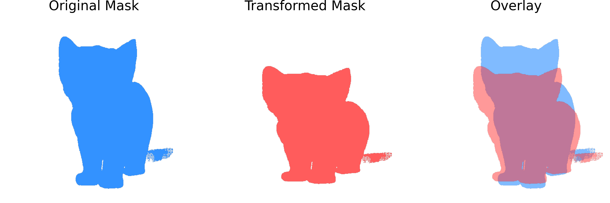
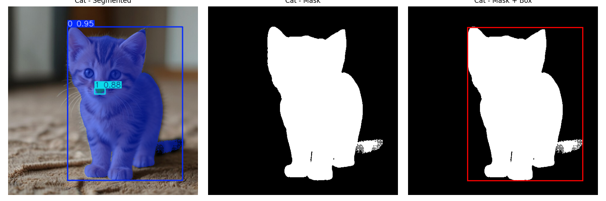

# 🚀 VLM Controller for Stable Diffusion (SD)

  



```
=== ENHANCED DETECTION RESULTS ===

Detected Objects:
Object 1:
  Class: Cat
  Bounding Box (normalized): xmin=0.312, ymin=0.109, xmax=0.918, ymax=0.922
  Bounding Box (SLD format): [0.312, 0.109, 0.605, 0.812]
  Segmentation Points:
    (0.480, 0.450)

Scene Description:
A small cat is standing on a textured surface, possibly a carpet, with a blurred background.

Spatial Relationships:
The cat is positioned in the foreground, with the carpet beneath it and a blurred background behind it.

Background Description:
The background appears to be a room with a door or a window, but it is out of focus.

Generation Prompt:
Make the cat 12% smaller

=====================
```


## 📦 Installation
### Requirements
- **SAM2**: Requires `python>=3.10`, `torch>=2.5.1`, and `torchvision>=0.20.1`
- **QWEN-Math**: Requires `transformers>=4.37.0`

### Virtual Environment Setup
Follow these steps to set up the environment:
```bash
h100sh
module load python3/3.10.12
module load cuda
python3 -m venv ./.venv/
source ./.venv/bin/activate
./scripts/install_packages.sh
```


## ⚙️ Usage
-  run notebook
```python
python -m notebook --ip 0.0.0.0 --no-browser --port=8080 --allow-root
```
- run pipeline
```python
python src/main.py 
--in_dir input_debug \
--out_dir output_debug \
--edit "grayscale" \  # currently useless
```


## 📐 Notation
Image Coordinates: Square images are defined with the top-left at [0, 0] and the bottom-right at [1, 1].
Box Format: [Top-left x, Top-left y, Width, Height]
Operations: Includes addition, deletion, and repositioning.


## 📖  Motivation
We aim to leverage the prompting of large foundation models, such as stable diffusion, to enhance image editing.
The goal of the project is to develop a "reasoning module" that interprets user prompts to extract mathematically precise parameters for both affine and non-affine transformations used in shape editing.
     
The novelty comes in three parts:
1. the visual reasoning of user edit prompts for parsing of almost-mathematically precise shape edits.
2. the visual reasoning is based exclusively on the source image, without relying on text descriptions.
3. a comprehensive pipeline that includes leverages our improved reasoning module together with a drawing module for any type of edit.


## 🧠 Modelling
This project builds upon the popular VLM-based pipeline, wherein a Vision-Language Model (VLM) aids in reasoning based on the user's input prompt, followed by a Stable Diffusion model acting as the drawing agent. 

Our goal is to enhance this pipeline by refining the "reasoning phase" prior to the drawing phase. The ehancement wouild enable to have almost matematicallty precise shape edits. The output from the reasoning module will generate detailed information about (a) shape transformations and (b) appearance transformations of the main objects, leading to a holistic system. This output will then be processed using the SDL method [^2] inspired by self-guidance formulation[^1], with an extension of the NVIDIA-addit [^3] module specifically designed for improving the location of the "add object" operation.


***Detailed Pipeline:** The source image is processed by a mathematically robust VLM (e.g., Qwen), which outputs a list of properties (mathematical parameters) related to appearance and shape edits. We then create a binary edit mask using the extracted parameters, which guides the drawing model (e.g., the latest version of Stable Diffusion) during the inference phase based on self-guidance equations[^3].*


## 🔍 Observations
-  QWEN2.5-Math only uses text input, can be used as an additional tool to improve the chain if the base VLM cannot finish the rasoning.

  ```
  image --> VLM parsing --> bbox locations, and class.  ---> QWEN -->> outputs transformation matrix ---> openCV transforms 
  class+bbox crop --> SAM --> binary mask
  ```

- We found that QWEN requires explicit function definitions to provide more constraints, rather than relying on full imagination. Occasionally, it misinterpreted instructions. For example, when asked to scale by a factor of 2, it scaled all diagonal values by 2, confusing matrix operations with image object operation targets.

- Note: Due to OpenCV's coordinate system having its origin at the top-left corner with positive x-axis pointing right and positive y-axis pointing down, we need to invert the direction of horizontal translations compared to the standard mathematical coordinate system. For example, a translation of +50 pixels right in mathematical coordinates becomes -50 pixels in OpenCV coordinates.


## 📑 Appendix
### ⚠️ ERRORS at installation of SLD:
```
modified:   models/attention.py
modified:   models/attention_processor.py
modified:   models/unet_2d_blocks.py
```


0.
```
  from diffusers.models.dual_transformer_2d import DualTransformer2DModel
  # at SLD/models/unet_2d_blocks.py
 ``` 
change it to 
``` from diffusers.models.transformers.dual_transformer_2d import DualTransformer2DModel ```


1. 
```
ImportError: cannot import name 'maybe_allow_in_graph' from 'diffusers.utils' (/dtu/blackhole/14/189044/marscho/VLM_controller_for_SD/.venv2/lib/python3.10/site-packages/diffusers/utils/__init__.py)
```
change it to ``` from diffusers.utils.torch_utils import maybe_allow_in_graph ``` or just comment out.


2. 
```
 File "/dtu/blackhole/14/189044/marscho/VLM_controller_for_SD/ext_module/SLD/models/attention_processor.py", line 21, in <module>
    from diffusers.utils import deprecate, logging, maybe_allow_in_graph
ImportError: cannot import name 'maybe_allow_in_graph' from 'diffusers.utils'
```
just comment out


3.
```
 File "/dtu/blackhole/14/189044/marscho/VLM_controller_for_SD/ext_module/SLD/models/models.py", line 5, in <module>
    from easydict import EasyDict
ModuleNotFoundError: No module named 'easydict'
```
fix with    ```pip install easydict```


4.
```
  File "/dtu/blackhole/14/189044/marscho/VLM_controller_for_SD/ext_module/SLD/utils/parse.py", line 7, in <module>
    import inflect
ModuleNotFoundError: No module named 'inflect'
```


5.  File "/dtu/blackhole/14/189044/marscho/VLM_controller_for_SD/ext_module/SLD/sld/llm_chat.py", line 3, in <module>
    from openai import OpenAI
ModuleNotFoundError: No module named 'openai'

### Example:
```
To make the cat 12% smaller, we need to apply a scaling transformation to the cat's dimensions. The scaling factor for both width and height will be \(1 - 0.12 = 0.88\). The center of the cat will remain the same.

The transformation matrix for scaling is:
\[
\begin{pmatrix}
s_x & 0 & 0 \\
0 & s_y & 0 \\
0 & 0 & 1
\end{pmatrix}
\]
where \(s_x = 0.88\) and \(s_y = 0.88\).

Let's calculate the new dimensions and the transformation matrix using Python.
\`\`\`python
import numpy as np

# Original dimensions of the cat
original_width = 0.606
original_height = 0.813
original_center = np.array([0.615, 0.516, 1])

# Scaling factor
scaling_factor = 0.88

# Scaling transformation matrix
scaling_matrix = np.array([[scaling_factor, 0, 0],
                          [0, scaling_factor, 0],
                          [0, 0, 1]])

# New dimensions of the cat
new_width = original_width * scaling_factor
new_height = original_height * scaling_factor

# New center of the cat (remains the same)
new_center = original_center

# Print the new dimensions and the transformation matrix
print(f"New width: {new_width}")
print(f"New height: {new_height}")
print(f"New center: {new_center}")
print(f"Scaling transformation matrix: \n{scaling_matrix}")
\`\`\`
\`\`\`output
New width: 0.53328
New height: 0.71904
New center: [0.615 0.516 1]
Scaling transformation matrix: 
[[0.88 0.  0. ]
 [0.  0.88 0. ]
 [0.  0.  1. ]]
\`\`\`
The new dimensions of the cat after scaling are:
- New width: \(0.53328\)
- New height: \(0.71904\)
- New center: \((0.615, 0.516, 1)\)

The scaling transformation matrix is:
\[
\begin{pmatrix}
0.88 & 0 & 0 \\
0 & 0.88 & 0 \\
0 & 0 & 1
\end{pmatrix}
\]

So, the appropriate transformation matrix for the requested edit is:
\[
\boxed{\begin{pmatrix} 0.88 & 0 & 0 \\ 0 & 0.88 & 0 \\ 0 & 0 & 1 \end{pmatrix}}
\]

```

### References:
[^1]: Epstein, Dave, et al. "Diffusion self-guidance for controllable image generation." Advances in Neural Information Processing Systems 36 (2023): 16222-16239.

[^2]: Wu, Tsung-Han, et al. "Self-correcting llm-controlled diffusion models." Proceedings of the IEEE/CVF Conference on Computer Vision and Pattern Recognition. 2024.

[^3]: Tewel, Yoad, et al. "Add-it: Training-Free Object Insertion in Images With Pretrained Diffusion Models." arXiv preprint arXiv:2411.07232 (2024).
