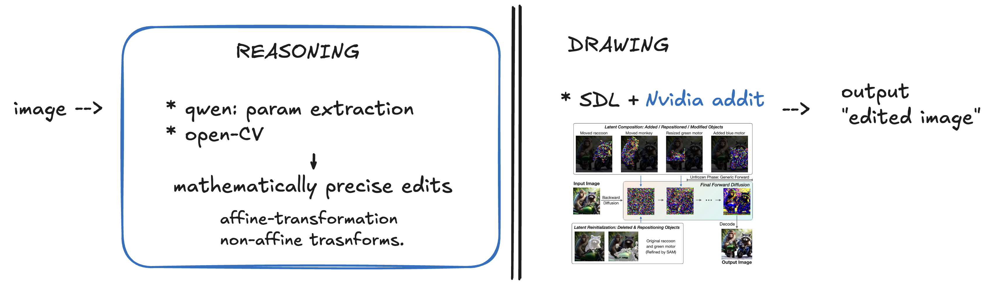
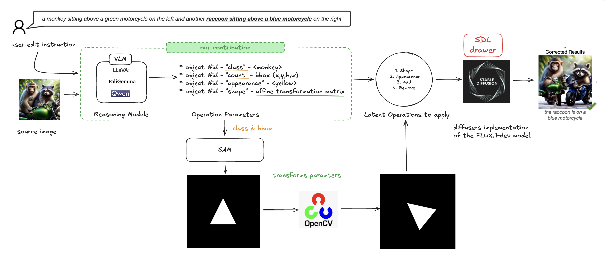

# VLM_controller_for_SD

### To Do List

Please let me work on the pipeline so I can improve my code skills and learn.
I gave you some parallel task you can work independerntly on 

#### Marco's Tasks:
- [ ] Set up the complete pipeline top-down with all modules:
  - [x] VLM parser for reasoning
  - [x] OpenCV shape editor for transformations 
  - [ ] SDL drawer for image generation
  
- [ ] evaluation
  - [ ] Define Metric
  - [ ] synthetic, or real dataset


#### Onur's Tasks:
- [ ] Generate synthetic dataset for testing non-affine transformations. 
- [ ] re-think / define edit prompts for each non-affine category

if the test dataset fails, than we can try fine-tuning QWEN.

#### Together (at last)
- [ ] Integrate NVIDIA's Add-it module into pipeline for improved object insertion
- [ ] download magicbrush and run/evaluate our pipeline on those testsevaluate
- [ ] ablation studies compare "SDL" with "Self-Guidance" drawers (not that important)


----
----


### Installation
SAM2 requires: python>=3.10, as well as torch>=2.5.1 and torchvision>=0.20.1
QWEN requiire: transformers>=4.37.0


venv installation
```
h100sh
module load python3/3.10.12
python3 -m venv ./.venv/
source ./.venv/bin/activate
./scripts/install_packages.sh


```


setup jupyter notebook from a secondary tmux session
```
python -m notebook --ip 0.0.0.0 --no-browser --port=8080 --allow-root
```


### Introduction
We aim to leverage the prompting of large foundation models, such as stable diffusion, to enhance 2D image editing through a human-machine collaboration methodology. Our research focuses on the test-time adaptation of large generative models and human-in-the-loop methods in computer vision.
The goal of the project is to develop a "reasoning module" that interprets user prompts to extract mathematically precise parameters for both affine and non-affine transformations used in shape editing.
     
The novelty comes in three parts:
1. the visual reasoning of user edit prompts for parsing of almost-mathematically precise shape edits.
2. the visual reasoning is based exclusively on the source image, without relying on text descriptions.
3. a comprehensive pipeline that includes leverages our improved reasoning module together with a drawing module for any type of edit.


### Modelling
This project builds upon the popular VLM-based pipeline, wherein a Vision-Language Model (VLM) aids in reasoning based on the user's input prompt, followed by a Stable Diffusion model acting as the drawing agent. 

Our goal is to enhance this pipeline by refining the "reasoning phase" prior to the drawing phase. The ehancement wouild enable to have almost matematicallty precise shape edits. The output from the reasoning module will generate detailed information about (a) shape transformations and (b) appearance transformations of the main objects, leading to a holistic system. This output will then be processed using the SDL method [^2] inspired by self-guidance formulation[^1], with an extension of the NVIDIA-addit [^3] module specifically designed for improving the location of the "add object" operation.



***General Idea:** We aim to separate the reasoning process (Phase I) from the drawing phase (Phase II). Our contribution focuses on enhancing the Vision-Language Model (VLM) parsing of user prompts by extracting mathematical parameters that will be used to create masks for transformations, including both affine and non-affine types.*



***Detailed Pipeline:** The source image is processed by a mathematically robust VLM (e.g., Qwen), which outputs a list of properties (mathematical parameters) related to appearance and shape edits. We then create a binary edit mask using the extracted parameters, which guides the drawing model (e.g., the latest version of Stable Diffusion) during the inference phase based on self-guidance equations[^3].*


### Observations
-  QWEN2.5-Math only uses text input, can be used as an additional tool to improve the chain if the base VLM cannot finish the rasoning.

- 
  ```
  image --> VLM parsing --> bbox locations, and class.  ---> QWEN -->> outputs transformation matrix ---> openCV transforms 
  class+bbox crop --> SAM --> binary mask
  ```

- We found that QWEN requires explicit function definitions to provide more constraints, rather than relying on full imagination. Occasionally, it misinterpreted instructions. For example, when asked to scale by a factor of 2, it scaled all diagonal values by 2, confusing matrix operations with image object operation targets.

- Note: Due to OpenCV's coordinate system having its origin at the top-left corner with positive x-axis pointing right and positive y-axis pointing down, we need to invert the direction of horizontal translations compared to the standard mathematical coordinate system. For example, a translation of +50 pixels right in mathematical coordinates becomes -50 pixels in OpenCV coordinates.


### References:
[^1]: Epstein, Dave, et al. "Diffusion self-guidance for controllable image generation." Advances in Neural Information Processing Systems 36 (2023): 16222-16239.

[^2]: Wu, Tsung-Han, et al. "Self-correcting llm-controlled diffusion models." Proceedings of the IEEE/CVF Conference on Computer Vision and Pattern Recognition. 2024.

[^3]: Tewel, Yoad, et al. "Add-it: Training-Free Object Insertion in Images With Pretrained Diffusion Models." arXiv preprint arXiv:2411.07232 (2024).


### ERRORS:


0.
```
  from diffusers.models.dual_transformer_2d import DualTransformer2DModel
  # at SLD/models/unet_2d_blocks.py
 ``` 
change it to 
``` from diffusers.models.transformers.dual_transformer_2d import DualTransformer2DModel ```


1. 
```
ImportError: cannot import name 'maybe_allow_in_graph' from 'diffusers.utils' (/dtu/blackhole/14/189044/marscho/VLM_controller_for_SD/.venv2/lib/python3.10/site-packages/diffusers/utils/__init__.py)
```
change it to ``` from diffusers.utils.torch_utils import maybe_allow_in_graph ``` or just comment out.


2. 
```
 File "/dtu/blackhole/14/189044/marscho/VLM_controller_for_SD/ext_module/SLD/models/attention_processor.py", line 21, in <module>
    from diffusers.utils import deprecate, logging, maybe_allow_in_graph
ImportError: cannot import name 'maybe_allow_in_graph' from 'diffusers.utils'
```
just comment out


3.
```
 File "/dtu/blackhole/14/189044/marscho/VLM_controller_for_SD/ext_module/SLD/models/models.py", line 5, in <module>
    from easydict import EasyDict
ModuleNotFoundError: No module named 'easydict'
```
fix with    ```pip install easydict```


4.
```
  File "/dtu/blackhole/14/189044/marscho/VLM_controller_for_SD/ext_module/SLD/utils/parse.py", line 7, in <module>
    import inflect
ModuleNotFoundError: No module named 'inflect'
```


5.  File "/dtu/blackhole/14/189044/marscho/VLM_controller_for_SD/ext_module/SLD/sld/llm_chat.py", line 3, in <module>
    from openai import OpenAI
ModuleNotFoundError: No module named 'openai'